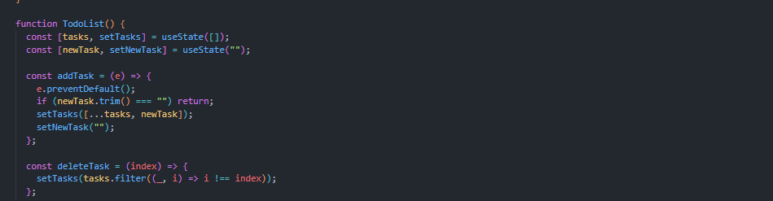
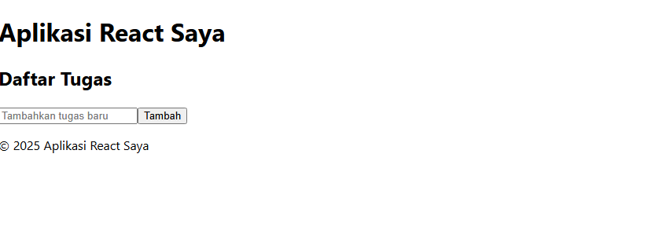
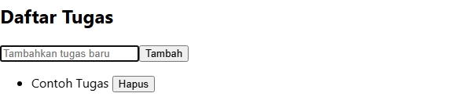
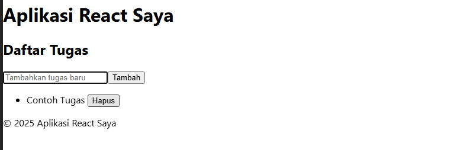
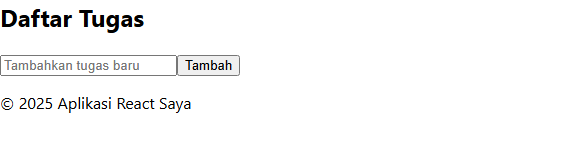

Tugas Tugas 
1. Buat komponen baru bernama TodoList yang menampilkan daftar tugas (todo list). Gunakan state untuk mengelola daftar tugas dan props untuk mengirim data tugas ke komponen anak.

2. Tambahkan fitur untuk menambahkan tugas baru ke dalam daftar menggunakan form input. 
 
 
3. Implementasikan fitur untuk menghapus tugas dari daftar.
 
